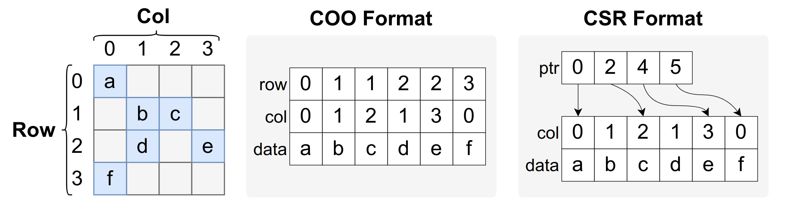
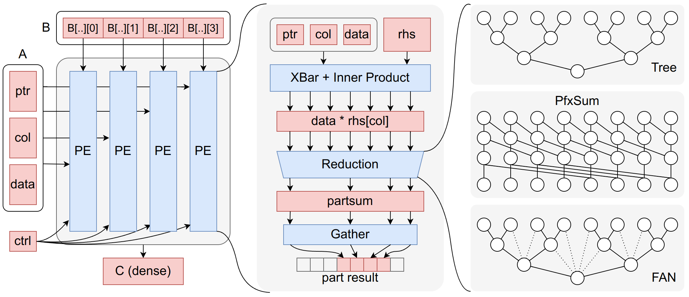
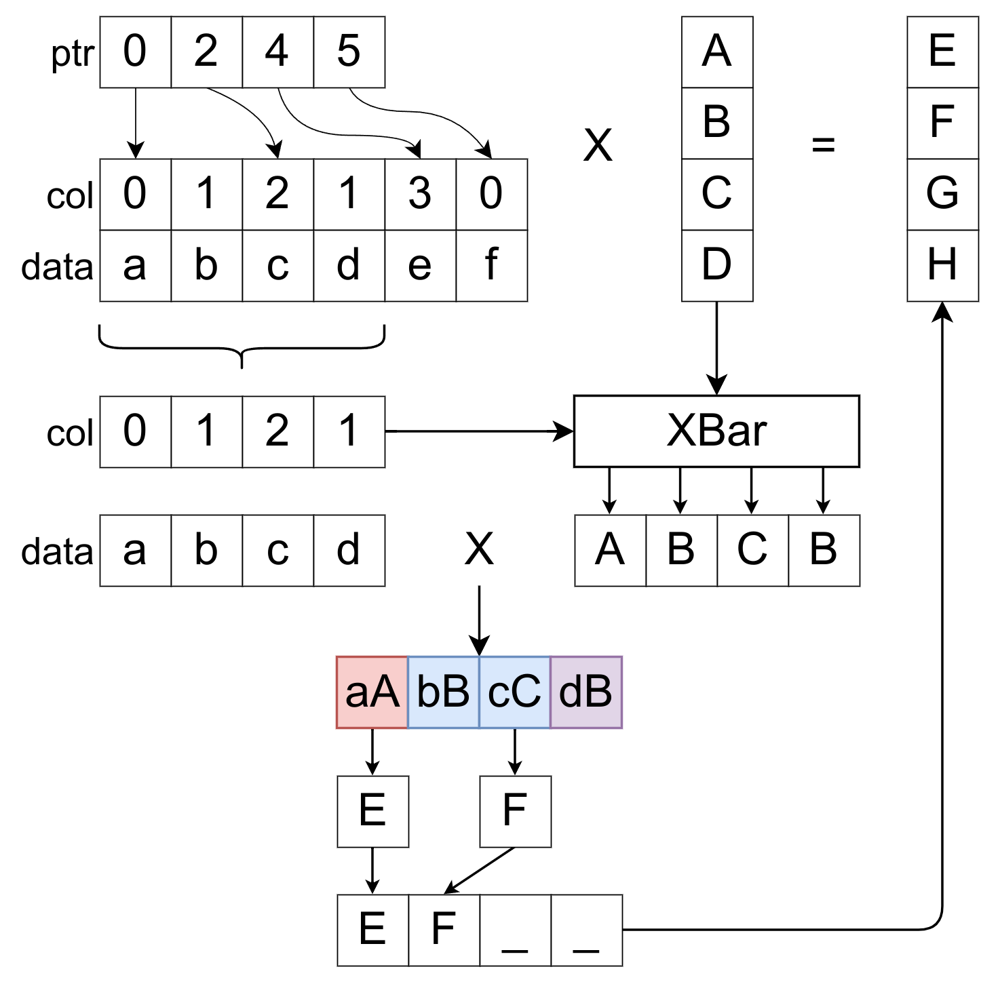
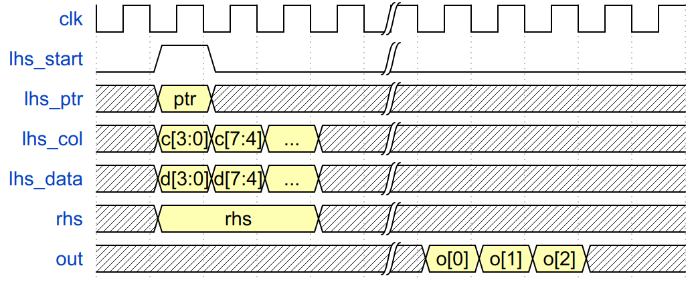
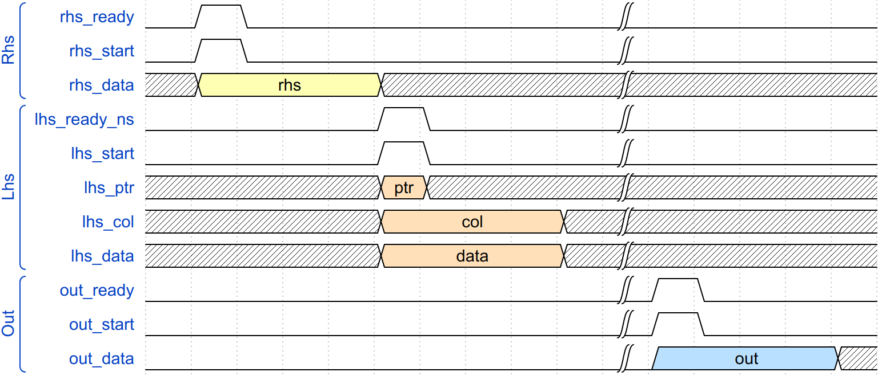
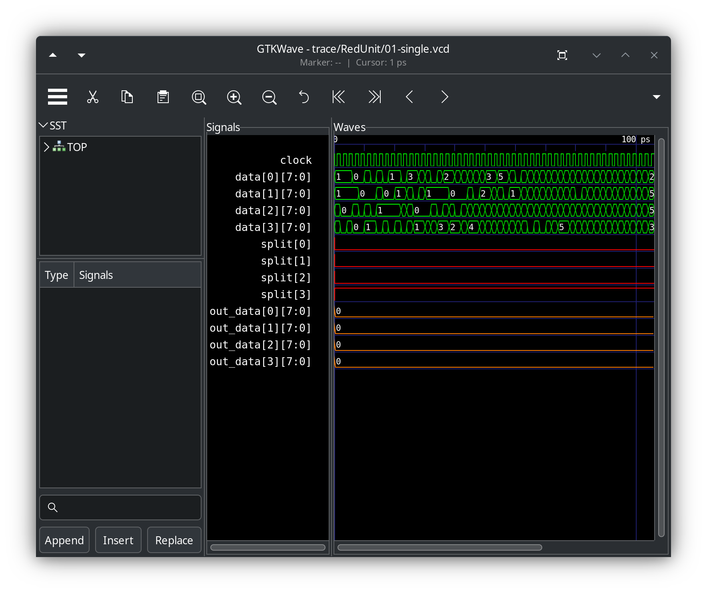

# SpMM Project

在这个 Project 里，你需要写一个 SpMM 的硬件加速器。这个 repo 会储存后续的代码更新。

有问题可以先到 [Issues](https://github.com/pku-liang/hlcd-spmm-project/issues?q=label:question) 里去找找看。

**第一次评测时间：12月27日**
**第二次评测时间：1月10日**

## UPD: final version 测试

* 60 分的 基础版本在第一次已经评测，期末补交扣 10 分
* 20 分的 PfxSum/Fan 由助教看代码或面测时提问
* 20 分的 halo, dbbuf, ws, os 用下面的代码评测

final version 的部分测试 tb 文件已经上传，可以运行下面的代码测试：

```shell
make -j`nproc` l2 >/dev/null
```

如果全部正确，测试结果如下：

```raw
COMPONENT SUCCESS RATE:
  halo                  = 1.0000
        dbbuf           = 1.0000
               ws       = 1.0000
                   os   = 1.0000
COMPLEXITY BEST ROUTE:
  halo                  success-rate=1.0000 cum-prod=1.0000 part-sum=1.0000
  halo  dbbuf           success-rate=1.0000 cum-prod=1.0000 part-sum=2.0000
  halo  dbbuf  ws       success-rate=1.0000 cum-prod=1.0000 part-sum=3.0000
  halo  dbbuf  ws  os   success-rate=1.0000 cum-prod=1.0000 part-sum=4.0000

COMPLEXITY SCORE:  4.0000  /  4
COMPONENT SCORE :  4.0000  /  4
FINAL SCORE     : 20.0000  / 20
```

* component score 实现了每个功能就有分
* complexity score 求出一个 halo, dbbuf, ws, os 的实现顺序，按照这个顺序将正确率的前缀积累加
* final score 是上面两个分数的平均值

如果你没有做出 60 分的版本，想要在期末重新写，可以用下面的脚本确认：

```shell
make -j`nproc` l1 > /dev/null
```

如果全部正确，结果如下：

```shell
../../RedUnit.tb.cpp L1 SCORE: 1
../../PE.tb.cpp L1 SCORE: 1
../../SpMM.tb.cpp L1 SCORE: 1
```

## SpMM 介绍

与稀疏矩阵相关的一些算子：

* **SpMM**：一般指稀疏矩阵乘稠密矩阵 (Sparse Matrix Multiplication)
* **SpMV**：一般指稀疏矩阵乘稠密向量 (Sparse Matrix Vector Multiplication)
* **SpMSpM**: 一般指稀疏矩阵乘稀疏矩阵
* **SpMSpV**：一般指稀疏矩阵乘稀疏向量（常用于 bfs）

在这里，我们主要介绍 SpMM。它的表达式与稠密矩阵乘法相同：

$$
C[i,j] = \sum_{k} A[i,k] B[k, j]
$$

但与稠密矩阵乘不同的是，稀疏矩阵 $A$ 中有大量的零。为了节省空间，同时减少计算量，一般通过压缩的方法来储存稀疏矩阵。常见有下面的压缩方法：

* **CSR** (Compressed Sparse Row)：按行压缩
* **CSC** (Compressed Sparse Column)：按列压缩
* **COO** (Coordinate List)：坐标表示

下面的图展示了 **COO** 和 **CSR** 格式的对比。**COO** 格式指将矩阵中所有的非零元素按 (row, col, data) 排列成一个列表。可以发现，row 数组里有大量冗余，表现是有很多连续且相同的元素。**CSR** 格式不记录 row 的数组，而是对行做索引。用一个 ptr 数组记录每一行的结束元素所在位置（更标准的是记录开始元素，但在这个 lab 里我们考虑结束元素）。

<div align='center'>

</div>

在上图的 **CSR** 格式中，第 i 行的元素的储存在 `ptr[i - 1] + 1 ~ ptr[i]` 的闭区间里。

根据输入格式、矩阵稀疏度的不同，有主要有下面的几类稀疏矩阵乘方法：

* **Row Based**: 每次将稀疏矩阵 $A$ 中的一个数与 $B$ 的一行相乘，适合 $B$ 很宽的场景
* **Inner Product**: 每次将稀疏矩阵 $A$ 的一行与 $B$ 的一列相乘，适合非零元个数适中的场景
* **Outer Product**: 每次将稀疏矩阵 $A$ 的一列与 $B$ 的一行相乘，适合非零元个数极其少的场景

在这个 lab 里我们实现 **Inner Product** 的方法。

## Project 介绍

### 总体介绍

在这个 Project 中，你需要写一个 SpMM 加速器，该加速器能够支持一个 NxN 的稀疏矩阵和一个 NxN 的稠密矩阵的乘法。该加速器的架构如下图所示：



加速器分成 PE 阵列，PE 和 规约单元三个层次。其中，规约单元有上面三种不同的实现方案。完成这个 Project 大致分成三个步骤：

1. **规约单元**：实现一个结构，它能够支持求序列的部分和
2. **PE 单元**：用规约单元实现一个 SpMV，计算稀疏矩阵乘以稠密向量
3. **PE 阵列**：将稠密矩阵的每一列分别分给每个 PE，并实现 Buffer/Stationary 等功能，构成一个完整的加速器

### 规约单元

$A$ 矩阵是稀疏的，每一轮读入的 $N$ 个值可能覆盖了多行，如下图所示，当 PE 的宽度为 4 的时候，第一次读入会算出 A 的前两行的结果：

<div align='center'>

</div>

此时，不能按照稠密矩阵乘法的方法计算总和，而应该按照每一行计算部分和。为了计算这样的部分和，需要用特殊的结构，比如：

* PfxSum：硬件前缀和，可以计算每个元素结尾的前缀和
* FAN Network：参考论文 [SIGMA: A Sparse and Irregular GEMM Accelerator with Flexible Interconnects for DNN Training](https://doi.org/10.1109/HPCA47549.2020.00015)

在本次 lab 里，规约单元的接口如下所示。其中 `split[i]` 为 1 表示第 i 个元素和 i+1 号元素在不同的行，`out_idx[i]` 表示输出第 i 位的部分和所在的位置。例如，在上图的例子中 `out_idx[1] = 2`，表示输出序列的第 1 个数 `F` 应该对应部分和序列中第 2 个元素，即 `cC` 下面的 `F`。

```verilog
module RedUnit(
    input   logic               clock,
                                reset,
    input   data_t              data[`N-1:0],
    input   logic               split[`N-1:0],
    input   logic [`lgN-1:0]    out_idx[`N-1:0],
    output  data_t              out_data[`N-1:0],
    output  int                 delay
);
```

RedUnit 必须是完全流水线的。也就是说，每个周期给定的输入会在固定一个延迟后输出。在实现中用 `delay` 输出来告诉 testbench 流水线延迟是多少。例如，你可以通过下面的代码来告诉 testbench 其 delay 是 4。

```verilog
assign delay = 4;
```

### PE

PE 将规约单元，内积单元，和相关的胶水逻辑整合到一起，构成一个能计算 SpMV 的基本结构。与 Reduction Unit 不同，PE 将直接接受 CSR 格式的稀疏矩阵作为输入。PE 内部需要实现将 CSR 格式转换成 RedUnit 能够支持的编码的方式。PE 的输入输出接口如下面所示：`lhs_start` 表示左矩阵的开始信号，`rhs` 表示稠密向量。

```verilog
module PE(
    input   logic               clock,
                                reset,
    input   logic               lhs_start,
    input   logic [`dbLgN-1:0]  lhs_ptr [`N-1:0],
    input   logic [`lgN-1:0]    lhs_col [`N-1:0],
    input   data_t              lhs_data[`N-1:0],
    input   data_t              rhs[`N-1:0],
    output  data_t              out[`N-1:0],
    output  int                 delay
);
```

时序图如下所示，在 `start` 的同时，输入 `ptr` 和第一部分的数据。接着继续输入 `lhs` 矩阵的其他值。在经过 `delay` 个 cycle 后，依次输出结果。PE 输出虽然有 N 个数，但并不是每个都是有效的。例如，在 start 所在的 cycle，PE 可能得到了 `row[0]` 和 `row[1]` 行的所有数据，那第一次输出 `o[0]` 中只有第 0 个数和第 1 个数是有效的。在 start 的下一个 cycle，PE 得到了 `row[2]` 的所有数据，那么第二次输出 `o[2]` 中只有 `out[2]` 是有效的。这样，输出的周期数和 lhs_col 的输入的周期数是一样的。在读入 `lhs` 的时候，`rhs` 也会同时读入，读入过程中 `rhs` 的值保持不变。

<!--
{signal: [
  {name: 'clk',       wave: 'p....|.....'},
  {name: 'lhs_start', wave: '010..|.....'},
  {name: 'lhs_ptr',   wave: 'x3x..|.....', data: ['ptr']},
  {name: 'lhs_col',   wave: 'x333x|.....', data: ['c[3:0]', 'c[7:4]', '...', '...']},
  {name: 'lhs_data',  wave: 'x333x|.....', data: ['d[3:0]', 'd[7:4]', '...', '...']},
  {name: 'rhs',       wave: 'x3..x|.....', data: ['rhs']},
  {name: 'out',       wave: 'x....|333x.', data: ['o[0]', 'o[1]', 'o[2]']}
]}
-->


* 图片看不清可以点击图片查看
<!--  -->

**Halo Adder**：在计算部分和的时候，经常会出现一个 `row` 的值被拆成两部分的情况。我们可以将上一个周期的最后段部分和储存下来，delay 一个周期后加到下一个周期部分和的第一段上。
* 稀疏矩阵是 NxN 的，稀疏矩阵的一行最多被拆成两段，而不会是三段。Halo Adder 里只需要保存一个元素。

### PE 阵列

PE 阵列将多个 PE 堆叠在一起，构成一个能够计算稀疏矩阵乘的结构。PE 阵列将 B 矩阵拆分成 N 列，每一列交给一个 PE 计算，再将各个 PE 的输出整合起来得到最终的输出。

```verilog
module SpMM(
    input   logic               clock,
                                reset,
    /* 输入在各种情况下是否 ready，ns：通常情况，ws：weight-stationary，os：output stationary */
    output  logic               lhs_ready_ns,
                                lhs_ready_ws,
                                lhs_ready_os,
                                lhs_ready_wos,
    input   logic               lhs_start,
    /* 如果是 weight-stationary, 这次使用的 rhs 将保留到下一次 */
                                lhs_ws,
    /* 如果是 output-stationary, 将这次的结果加到上次的 output 里 */
                                lhs_os,
    input   logic [`dbLgN-1:0]  lhs_ptr [`N-1:0],
    input   logic [`lgN-1:0]    lhs_col [`N-1:0],
    input   data_t              lhs_data[`N-1:0],
    output  logic               rhs_ready,
    input   logic               rhs_start,
    input   data_t              rhs_data [3:0][`N-1:0],
    output  logic               out_ready,
    input   logic               out_start,
    output  data_t              out_data [3:0][`N-1:0],
    output  int                 num_el
);
```

下面给出了 PE 阵列通常计算矩阵乘法的时序图。最开始，rhs 的 buffer 是空的，阵列首先读入 rhs。当 rhs 读入完成，rhs buffer 非空的时候，允许输入 lhs。输入 lhs 后立刻开始计算，并在一段时间后放到 output buffer 里面。最后，再一次性将 output buffer 的矩阵输出。注意，**稠密矩阵输入/输出的基本单位是 4 行**。

* 稠密矩阵会经过 N/4 个周期完成输入/输出，第 i 个周期输入 [i*4+3:i*4] 行的元素，第 0 周期 start 信号为 1
* 写移位寄存器的时候，请注意方向，先输入/输出的是第一行，不是最后一行

<!--
{signal: [
  ['Rhs',
   {name: 'rhs_ready',    wave: '010.......|.....'},
   {name: 'rhs_start',    wave: '010.......|.....'},
   {name: 'rhs_data',     wave: 'x3...x....|.....', data: ['rhs']},
  ],
  ['Lhs',
   {name: 'lhs_ready_ns', wave: '0....10...|.....'},
   {name: 'lhs_start',    wave: '0....10...|.....'},
   {name: 'lhs_ptr',      wave: 'x....4x...|.....', data: ['ptr']},
   {name: 'lhs_col',      wave: 'x....4...x|.....', data: ['col']},
   {name: 'lhs_data',     wave: 'x....4...x|.....', data: ['data']},
  ],
  ['Out',
   {name: 'out_ready',    wave: '0.........|10...'},
   {name: 'out_start',    wave: '0.........|10...'},
   {name: 'out_data',     wave: '0.........|5...x', data: ['out']}
  ]
]}
-->


* 图片看不清可以点击图片查看


<!--  -->

阵列除了支持通常的 SpMM 外，还需要支持 Weight Stationary 和 Output Stationary

* Weight Stationary 指在计算下一次 A * B 的时候，B 矩阵没有发生变化，不需要重复读入
* Output Stationary 指在这次计算中，直接将 A * B 加到上一次的输出矩阵中

为了进一步增大阵列的吞吐量，可以将 rhs buffer 和 output buffer 实现为 double buffer。保证在计算的同时，也可以读入下一次计算的输入数据。

<details>
<summary>Weight Stationary 的时序图</summary>


</details>

## 测试与评分

此次 project 根据实现的功能和参数化能力打分。参数化指可以通过修改 N 的值，自动生成出合法的硬件。

### 接口与编码规定

`RedUnit`, `PE`, `SpMM` 的输入输出接口已经在 `SpMM.sv` 里写好了。你可以随意为接口添加新的输出或输入，测试脚本会忽略添加的输入和输出。

输入数据的格式为 `data_t`，它被定义成了一个 struct。请保证 `data_t` 的加法和乘法计算具有 1 cycle 的 delay。你可以用 `add_` 和 `mul_` 模块来实现加法和乘法。

```verilog
typedef struct packed { logic [`W-1:0] data; } data_t;
```

在这次 project 中，我们用宏来实现参数化：

```verilog
`ifndef N
`define N              16
`endif
`define lgN     ($clog2(`N))
`define dbLgN (2*$clog2(`N))
```

### 测试方法

助教已经为你们写好了一些 testbench 和 自动化脚本。

```shell
make N=16 RedUnit
make N=16 PE
make N=16 SpMM
```

运行 `make` 会生成类似下面的路径结构：

```shell
trace
├── PE
│   ├── 01-full.vcd
│   ├── 02-half.vcd     # 波形文件
│   ├── run.log         # 输出文件，见下一节
│   └── wave.gtkw       # gtkwave 配置文件
├── RedUnit
│   ├── 01-single.vcd
│   ├── 02-full.vcd
│   ├── run.log
│   └── wave.gtkw
└── SpMM
    ├── 01-ns-onepass.vcd
    ├── 02-rhs-dbbuf.vcd
    ├── run.log
    └── wave.gtkw
```

#### 调试输出

如果某些测试点 fail，测试脚本会将错误的程序输出出来。下面是 reduction unit 的调试输出，`|` 分隔了部分和的区间：

> ```raw
> Err:         0      1      2      3   
>   Data:     16  | 110  | 253    146  |
>   PSum:     16  | 110  |        143  |
>   OutIdx:    0      1      3      2   
>   Expect:   16    110    143          
>   Get:       0      0      0      0   
> ```

下面是 PE 的调试输出，每个错误的数据会将稀疏矩阵和向量展示出来：

> ```raw
> Error in trace/PE/13-rand.vcd
> MAT[ 0]:    8    1    9         |   1
> MAT[ 1]:         3              |   1
> MAT[ 2]:                   8    |   1
> MAT[ 3]:         4    7    6    |   1
> got prod:   0    0    0    0 
> expect:    18    3    8   17 
> ```

#### 查看波形

助教已经为你写了一个自动脚本，里面预设了重要的输入输出信号，用下面的命令启动 gtkwave：

```shell
./gtkwave.sh trace/RedUnit/01-single.vcd
```



### 评分标准

评分按照功能分数和性能分数给定，下发的测试点只是占最终测试点的一部分。

* 功能分数：加速器的每个功能根据实现难度，赋予一定分数
* 性能分数：即使实现了某个功能，但没有达到其应有的 latency / throughput，会失去这个分数

60 分的部分：没有stationary，稀疏矩阵 A 是稠密的。也就是说 A 每次读一整行，且刚好是一行。你可以直接忽略 ptr, col 的输入，规约单元只实现一个加法树。

下面给出功能分数列表（暂定），后续可能根据同学们的实现情况修改。

|       | tree | pfxsum | fan | halo | dbbuf | wei-sta | out-sta |
| ----- | ---- | ------ | --- | ---- | ----- | ------- | ------- |
| N=16  | 0    | 8      | 16  | 4    | 4     | 4       | 4       |
| N=any | 2    | 12     | 20  | 5    | 5     | 5       | 5       |

* tree, pfxsum, fan：Reduction Unit 的实现方法（三选一）
* halo：PE 里实现 halo adder，支持跨边界求和
* dbbuf：rhs buf 和 output buf 支持双 buffer
* wei-sta, out-sta：支持两种 stationary 模式

N=any 保证 N 是 2 的幂，且大于等于 4。有时候，你可能实现了某个模块的 N=16 版本，另一个模块的 N=any 版本。你可以用 `generate if` 来做分割：

```verilog
module RedUnit(...);
generate
    if(`N == 16) RedUnit_16 rdu(.*);
    else RedUnit_any rdu(.*);
endgenerate
endmodule
```

下面给一个建议的实现顺序：

1. 60 分：走通基本路线
2. 72 分：pfxsum
3. 77 分：pfxsum + halo
4. 82 分：pfxsum + halo + dbbuf
5. 87 分：pfxsum + halo + dbbuf + wei-sta
6. 92 分：pfxsum + halo + dbbuf + wei-sta + out-sta
7. 94 分：fan(n=16) + halo + dbbuf + wei-sta + out-sta
8. 100 分：fan(any) + halo + dbbuf + wei-sta + out-sta

### 提交时间

两周后第一次评测，评测 60 分的版本，四周后第二次评测，评测剩下的 40 分。

60 分的版本要求：每个 testbench 的第一个测试点能够通过

* redunit 能够计算全部和，可以用加法树实现
* PE 能够正常得将数据交给 redunit
* PE 阵列能够读入右矩阵，读入左矩阵，完成一次计算，然后输出

**第一次评测时间：12月27日**
**第二次评测时间：1月10日**
