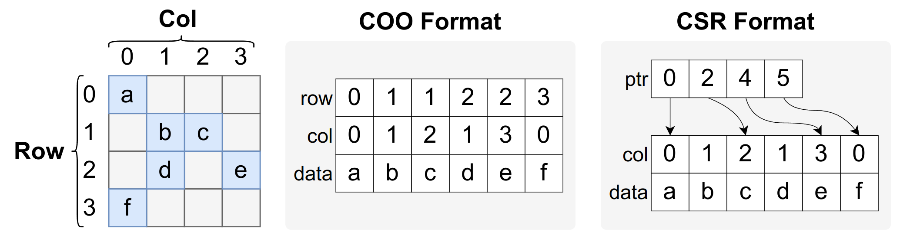
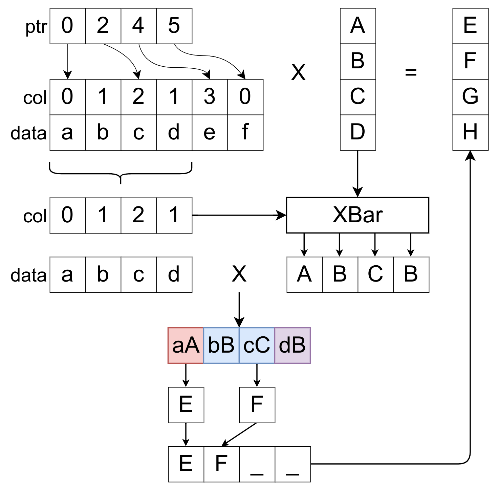
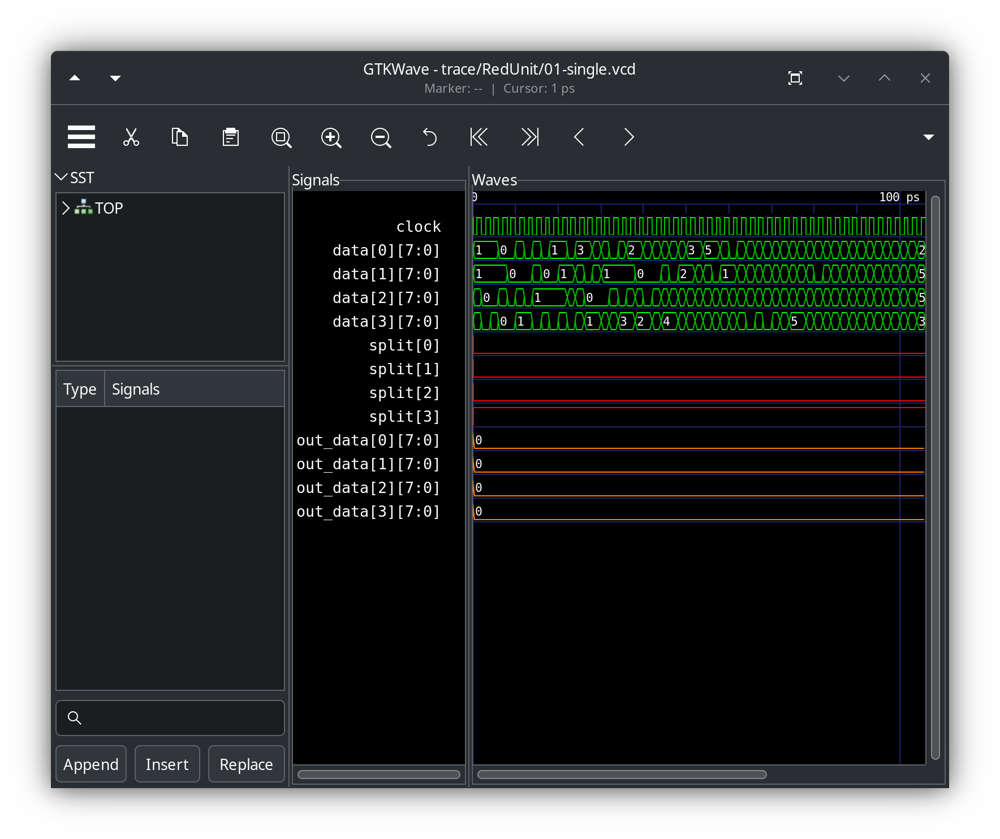

# My_SpMM

This is the final project of the "Chip Design using High-level Programming Language" taught by Prof Eric Liang.

In this project, I develop a hardware accelerator for SpMM (Sparse Matrix-Dense Matrix Multiplication). 

## SpMM Introduction

Common operators related to sparse matrices include:

* **SpMM**: Sparse Matrix-Dense Matrix Multiplication
* **SpMV**: Sparse Matrix-Dense Vector Multiplication
* **SpMSpM**: Sparse Matrix-Sparse Matrix Multiplication
* **SpMSpV**: Sparse Matrix-Sparse Vector Multiplication (commonly used in BFS)

Here, we focus on SpMM. Its mathematical expression is identical to dense matrix multiplication:

$$
C[i,j] = \sum_{k} A[i,k] B[k, j]
$$

However, unlike dense matrix multiplication, the sparse matrix $A$ contains numerous zeros. To conserve space and reduce computational complexity, sparse matrices are typically stored using compression methods. Common compression formats include:

* **CSR** (Compressed Sparse Row)
* **CSC** (Compressed Sparse Column)
* **COO** (Coordinate List)

The following figure illustrates the comparison between **COO** and **CSR** formats. The **COO** format represents non-zero elements as (row, col, data) tuples in a list. Note that the row array contains significant redundancy, shown as consecutive identical elements. The **CSR** format eliminates the row array, instead using row indexing. A ptr array records the ending position of each row's elements (while standard practice records starting positions, in this lab we consider ending positions).

<div align='center'>

</div>

In the CSR format shown above, elements of row i are stored in the closed interval `ptr[i - 1] + 1 ~ ptr[i]`.

Based on input format and matrix sparsity, there are several main approaches to sparse matrix multiplication:

* **Row Based**: Multiplies each number in sparse matrix $A$ with a row of $B$, suitable for wide $B$ matrices
* **Inner Product**: Multiplies a row of sparse matrix $A$ with a column of $B$, suitable for moderate numbers of non-zero elements
* **Outer Product**: Multiplies a column of sparse matrix $A$ with a row of $B$, suitable for extremely sparse matrices

In this lab, we implement the **Inner Product** approach.

## Project Overview

### General Introduction

In this project, you will develop an SpMM accelerator capable of multiplying an NxN sparse matrix with an NxN dense matrix. The accelerator architecture is shown below:


The accelerator is organized into three levels: PE array, PE, and reduction unit. The reduction unit has three different implementation options. Completing this project involves three main steps:

1. **Reduction Unit**: Implement a structure supporting partial sum computation of sequences
2. **PE Unit**: Implement SpMV using the reduction unit to compute sparse matrix-dense vector multiplication
3. **PE Array**: Distribute each column of the dense matrix to individual PEs and implement Buffer/Stationary functionalities to form a complete accelerator

### Reduction Unit

Matrix $A$ is sparse, and each round of N values read may cover multiple rows. As shown below, when PE width is 4, the first read will compute results for the first two rows of A:

<div align='center'>

</div>

In this case, we cannot compute sums using dense matrix multiplication methods, but must calculate partial sums by row. 

In this lab, the reduction unit interface is as follows. Here, `split[i] = 1` indicates elements i and i+1 are in different rows, and `out_idx[i]` indicates the position of the i-th partial sum in the output. For example, in the above figure, `out_idx[1] = 2` means the first number `F` in the output sequence should correspond to the second element in the partial sum sequence, i.e., `F` below `cC`.

```verilog
module RedUnit(
    input   logic               clock,
                                reset,
    input   data_t              data[`N-1:0],
    input   logic               split[`N-1:0],
    input   logic [`lgN-1:0]    out_idx[`N-1:0],
    output  data_t              out_data[`N-1:0],
    output  int                 delay
);
```

RedUnit must be fully pipelined. This means inputs given each cycle will output after a fixed delay. The implementation uses `delay` output to inform the testbench of the pipeline delay. For example, you can tell the testbench its delay is 4 using:

```verilog
assign delay = 4;
```

### PE

The PE integrates the reduction unit, inner product unit, and related glue logic to form a basic structure capable of computing SpMV. Unlike the Reduction Unit, PE directly accepts sparse matrices in CSR format as input. The PE must implement conversion from CSR format to RedUnit-compatible encoding. The PE input/output interface is shown below: `lhs_start` indicates the start signal for the left matrix, `rhs` represents the dense vector.

```verilog
module PE(
    input   logic               clock,
                                reset,
    input   logic               lhs_start,
    input   logic [`dbLgN-1:0]  lhs_ptr [`N-1:0],
    input   logic [`lgN-1:0]    lhs_col [`N-1:0],
    input   data_t              lhs_data[`N-1:0],
    input   data_t              rhs[`N-1:0],
    output  data_t              out[`N-1:0],
    output  int                 delay
);
```

The timing diagram is shown below. At `start`, input `ptr` and the first portion of data are provided. Then continue inputting other values of the `lhs` matrix. After `delay` cycles, results are output sequentially. While PE output has N numbers, not all are valid. For example, in the start cycle, PE may receive all data for `row[0]` and `row[1]`, so only the first two numbers in the first output `o[0]` are valid. In the next cycle after start, PE receives all data for `row[2]`, so only `out[2]` in the second output `o[2]` is valid. Thus, the number of output cycles equals the number of lhs_col input cycles. During `lhs` input, `rhs` is also read simultaneously, with `rhs` values remaining constant during the reading process.


**Halo Adder**: When computing partial sums, a `row`'s values are often split into two parts. We can store the partial sum of the last segment from the previous cycle and add it to the first segment of the next cycle's partial sum after a one-cycle delay.
* The sparse matrix is NxN, and a sparse matrix row can be split into at most two segments, not three. The Halo Adder only needs to store one element.

### PE Array

The PE array stacks multiple PEs together to form a structure capable of computing sparse matrix multiplication. The PE array divides matrix B into N columns, assigns each column to a PE for computation, and integrates the outputs from each PE to obtain the final output.

```verilog
module SpMM(
    input   logic               clock,
                                reset,
    /* Input ready signals for various cases: ns: normal, ws: weight-stationary, os: output stationary */
    output  logic               lhs_ready_ns,
                                lhs_ready_ws,
                                lhs_ready_os,
                                lhs_ready_wos,
    input   logic               lhs_start,
    /* If weight-stationary, the current rhs will be retained for next use */
                                lhs_ws,
    /* If output-stationary, this result will be added to the previous output */
                                lhs_os,
    input   logic [`dbLgN-1:0]  lhs_ptr [`N-1:0],
    input   logic [`lgN-1:0]    lhs_col [`N-1:0],
    input   data_t              lhs_data[`N-1:0],
    output  logic               rhs_ready,
    input   logic               rhs_start,
    input   data_t              rhs_data [3:0][`N-1:0],
    output  logic               out_ready,
    input   logic               out_start,
    output  data_t              out_data [3:0][`N-1:0],
    output  int                 num_el
);
```

Below is the timing diagram for normal matrix multiplication in the PE array. Initially, the rhs buffer is empty, and the array first reads in rhs. When rhs reading completes and the rhs buffer is non-empty, lhs input is allowed. Computation begins immediately after lhs input and results are placed in the output buffer after some time. Finally, the output buffer matrix is output at once. Note that **the basic unit for dense matrix input/output is 4 rows**.

* Dense matrix input/output completes in N/4 cycles, with elements from rows [i*4+3:i*4] input in cycle i, and start signal = 1 in cycle 0
* When writing shift registers, note the direction: first row is input/output first, not the last row


The array must support normal SpMM as well as Weight Stationary and Output Stationary modes:

* Weight Stationary: When computing the next A * B, matrix B remains unchanged and doesn't need to be re-read
* Output Stationary: In the current computation, A * B is directly added to the previous output matrix

To further increase array throughput, rhs buffer and output buffer can be implemented as double buffers, ensuring input data for the next computation can be read during current computation.

<details>
<summary>Weight Stationary Timing Diagram</summary>


</details>

## Testing and Grading

This project is graded based on implemented functionality and parameterization capability. Parameterization means the hardware can be automatically generated with valid configurations by modifying N.

### Testing Methods

TAs have prepared testbenches and automation scripts.

```shell
make N=16 RedUnit
make N=16 PE
make N=16 SpMM
```

Running `make` generates a path structure similar to:

```shell
trace
├── PE
│   ├── 01-full.vcd
│   ├── 02-half.vcd     # Waveform files
│   ├── run.log         # Output files, see next section
│   └── wave.gtkw       # gtkwave configuration file
├── RedUnit
│   ├── 01-single.vcd
│   ├── 02-full.vcd
│   ├── run.log
│   └── wave.gtkw
└── SpMM
    ├── 01-ns-onepass.vcd
    ├── 02-rhs-dbbuf.vcd
    ├── run.log
    └── wave.gtkw
```

#### Debug Output

For failed test points, the test script outputs erroneous program output. Below is debug output for the reduction unit, with `|` separating partial sum intervals:

> ```raw
> Err:         0      1      2      3   
>   Data:     16  | 110  | 253    146  |
>   PSum:     16  | 110  |        143  |
>   OutIdx:    0      1      3      2   
>   Expect:   16    110    143          
>   Get:       0      0      0      0   
> ```

Below is PE debug output, showing sparse matrix and vector for each erroneous data:

> ```raw
> Error in trace/PE/13-rand.vcd
> MAT[ 0]:    8    1    9         |   1
> MAT[ 1]:         3              |   1
> MAT[ 2]:                   8    |   1
> MAT[ 3]:         4    7    6    |   1
> got prod:   0    0    0    0 
> expect:    18    3    8   17 
> ```

#### Viewing Waveforms

TAs have prepared an automatic script with preset important input/output signals. Start gtkwave using:

```shell
./gtkwave.sh trace/RedUnit/01-single.vcd
```



## Final Version Testing

The test bench files for the final version have been uploaded. You can run the tests using:

```shell
make -j`nproc` l2 >/dev/null
```

If all tests pass successfully, the results should appear as follows:

```raw
COMPONENT SUCCESS RATE:
  halo                  = 1.0000
        dbbuf           = 1.0000
               ws       = 1.0000
                   os   = 1.0000
COMPLEXITY BEST ROUTE:
  halo                  success-rate=1.0000 cum-prod=1.0000 part-sum=1.0000
  halo  dbbuf           success-rate=1.0000 cum-prod=1.0000 part-sum=2.0000
  halo  dbbuf  ws       success-rate=1.0000 cum-prod=1.0000 part-sum=3.0000
  halo  dbbuf  ws  os   success-rate=1.0000 cum-prod=1.0000 part-sum=4.0000

COMPLEXITY SCORE:  4.0000  /  4
COMPONENT SCORE :  4.0000  /  4
FINAL SCORE     : 20.0000  / 20
```

* Component score is awarded for implementing each functionality
* Complexity score is calculated by determining an implementation sequence for halo, dbbuf, ws, os, then accumulating the prefix products of success rates in this sequence
* Final score is the average of the above two scores
